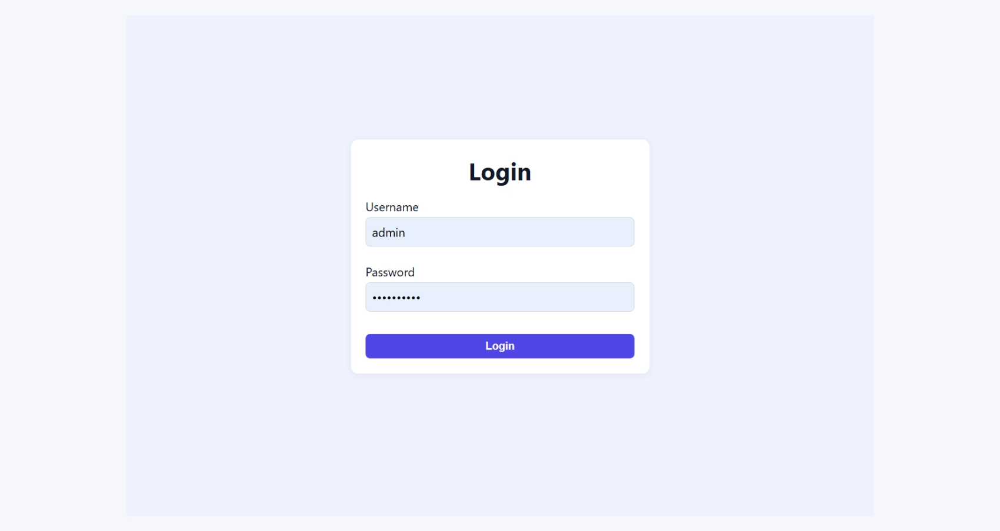
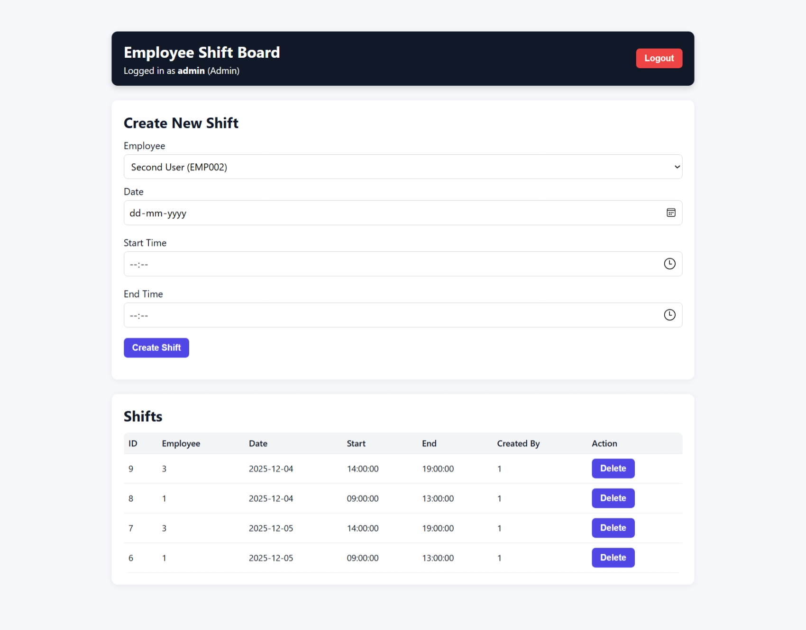
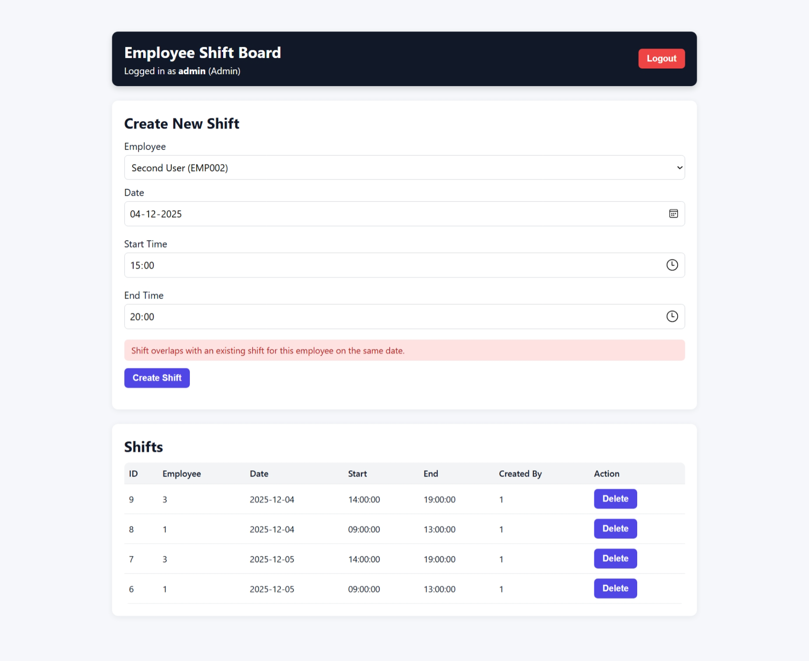
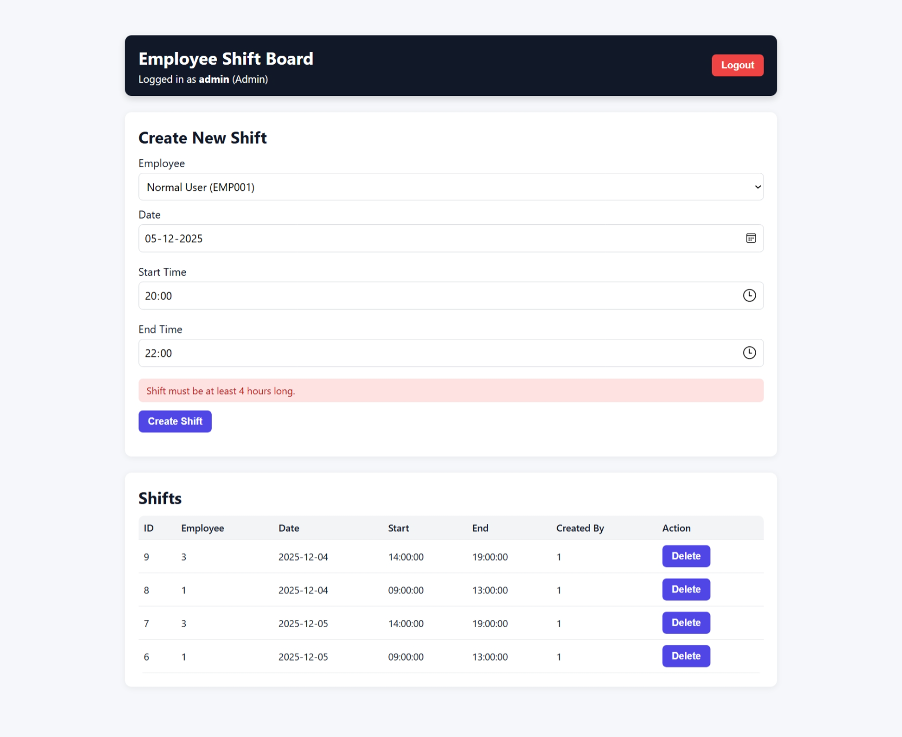
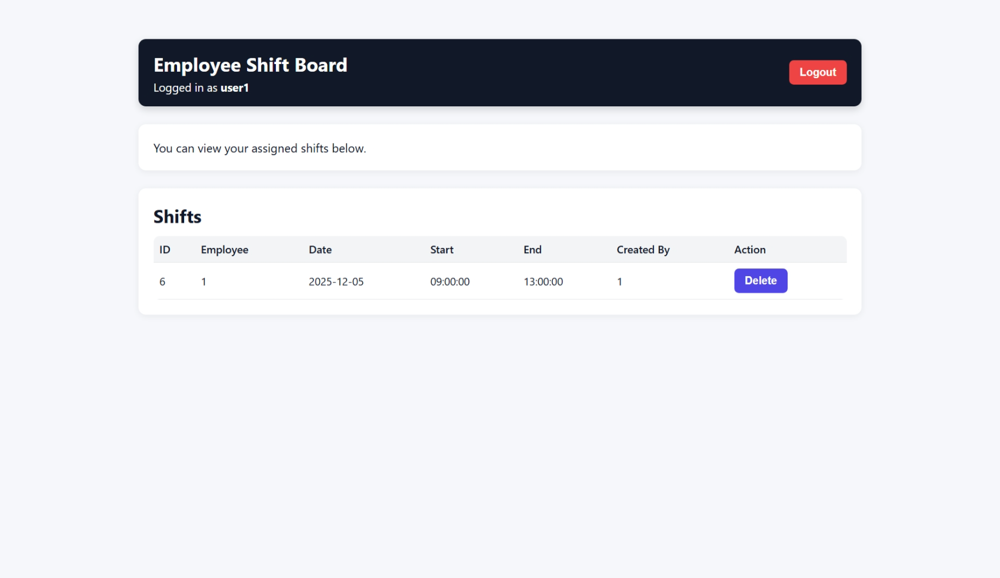

🟦 Employee Shift Board — Django + React

A full-stack employee shift management system that enforces business rules like shift overlap prevention, minimum duration rules, and role-based access.

Built as an assignment project using Django REST Framework, React, and JWT Authentication.

🚀 Features Overview
🔐 Authentication (JWT)

Login using username + password

Access + Refresh tokens

Tokens stored in localStorage on the frontend

Axios interceptor automatically attaches the
Authorization: Bearer <token> header

👥 Role-Based Access
Role	Permissions
Admin/Staff	Create shifts, delete shifts, view all shifts
Reviewer (Staff)	Same as admin
Normal User	View only their own shifts
🕒 Shift Rules (Business Logic)

Minimum 4-hour shift

No overlapping shifts for the same employee on the same date

Validations are performed entirely in the backend

Backend enforces mapping between user → employee

📡 API Endpoints
Method	Endpoint	Description
POST	/api/login/	Get JWT access + refresh tokens
GET	/api/employees/	List employees (auth required)
GET	/api/shifts/	List shifts (admin: all, user: own only)
POST	/api/shifts/	Create a new shift
DELETE	/api/shifts/<id>/	Delete a shift
Filtering Support
/api/shifts/?employee=<ID>
/api/shifts/?employee=<ID>&date=YYYY-MM-DD

🏗 Tech Stack
Backend

Django

Django REST Framework

SimpleJWT

SQLite (default Django DB)

Frontend

React (CRA)

Axios

React Router

📦 Project Setup Instructions
1️⃣ Backend Setup (Django)
# 1. Create virtual environment (optional)
python -m venv venv
source venv/bin/activate  

# 2. Install dependencies
pip install -r requirements.txt

# 3. Run migrations
python manage.py migrate

# 4. Seed users + employees (admin, normal user, reviewer)
python manage.py seed

# 5. Start backend server
python manage.py runserver

✔ Seeded Users
Role	Email	Password
Admin	sakshigharat701@gmail.com
	sakshi@123
User	user1@example.com
	User@123
Reviewer	hire-me@anshumat.org
	HireMe@2025!

Reviewer is a staff user, so they can log in like an admin and test all features.

2️⃣ Frontend Setup (React)
npm install
npm start

📁 Folder Structure
backend/
  shifts/
  config/
  manage.py

frontend/
  src/

docs/
  (screenshots here)

README.md

🔧 Core Backend Validation (ShiftSerializer)

✓ Minimum 4 hours

✓ No overlap with existing shifts

✓ End time must be after start time

✓ Normal users can only create/delete their own shifts

✓ Admin can manage all shifts

🖥 Dashboard Behavior
✔ Admin View

Can create new shifts

Sees all employees in dropdown

Can delete any shift

Header shows: Logged in as admin (Admin)

✔ Normal User View

No “Create Shift” form

Sees only their own shifts

Cannot delete shifts belonging to others

📸 Screenshots

✔ Assignment Requirements Coverage
Requirement	Status
JWT Login	✅ Done
List Employees	✅ Done
List/Create/Delete Shifts	✅ Done
Filter Shifts	✅ Implemented
No Overlapping	✅ Enforced
Minimum 4 Hours	✅ Enforced
Admin vs User Permissions	✅ Fully implemented
Simple React UI	✅ Implemented
Reviewer account	✅ Added
